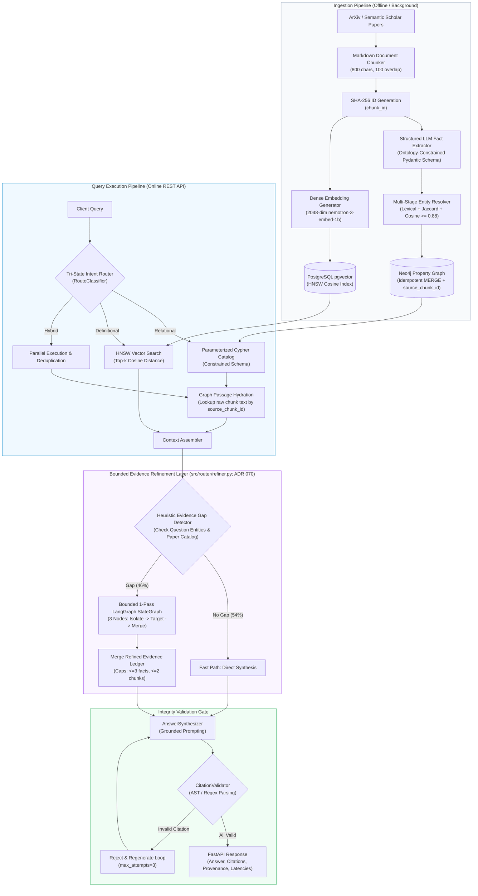

[← README](../README.md) | [PRD](PRD.md) | [TRD](TRD.md) | [Design](DESIGN.md) | [Architecture](ARCHITECTURE.md) | [Flows](FLOWS.md) | [Codebase Map](CODEBASE_MAP.md) | [Decisions](DECISIONS.md) | [Tasks](TASKS.md) | [Scorecard](BENCHMARK_SCORECARD.md)
---

# Architecture & System Design

## 1. System Overview & Dual-Store Topology

Enterprise technical and scientific literature (such as AI/ML arXiv publications) exhibits two distinct representations of information:
1. **Unstructured Descriptive Prose**: Algorithmic explanations, qualitative claims, definitions, and mathematical formulations.
2. **Structured Relational Topology**: Cross-paper citation networks, algorithmic lineages (which method extends what), co-authorship networks, and benchmark evaluation matrices.

Standard RAG architectures force an unnatural compromise: pure vector RAG loses multi-hop relational structure, whereas pure knowledge-graph text-to-Cypher generates invalid queries and omits descriptive context.

This platform implements a **Dual-Store Hybrid GraphRAG** architecture uniting a Neo4j property graph with a PostgreSQL `pgvector` store, joined at the ingestion level via persistent `source_chunk_id` foreign keys.

---

## 2. Component Roles & Specifications

### 2.1 Extraction & Ingestion Pipeline
- **Input**: Markdown-converted scientific e-prints.
- **Chunking**: Natural section and paragraph splitting (800 target characters, 100 character overlap). Each chunk is deterministically tagged with `chunk_id = sha256(f"{doc_id}:{section}:{idx}:{text}")[:16]`.
- **Fact Extraction**: Constrained JSON schema extraction mapping sentences into typed facts (`subject`, `relation`, `object`, `source_chunk_id`) conforming to [`Docs/ONTOLOGY.md`](ONTOLOGY.md).
- **Extraction Cache**: Chunk hash cache (`data/cache/extraction_cache.json`) prevents duplicate LLM extraction costs on unchanged documents.

### 2.2 Multi-Stage Entity Resolution
Mitigates entity fragmentation and duplicate graph nodes across papers:
1. **Stage 1 (Lexical)**: NFKD unicode normalization, lowercasing, punctuation stripping.
2. **Stage 2 (Token Jaccard)**: Fast n-gram overlap against registered canonical nodes.
3. **Stage 3 (Dense Embedding)**: Cosine similarity ($\ge 0.88$) against canonical entity cluster centroids.
- Resolved nodes store alternative surface mentions in an `aliases` array property.

### 2.3 Neo4j Property Graph Store
- **Entities**: `Paper`, `Author`, `Method`, `Dataset`, `Institution`, `Task`, `Metric`.
- **Relationships**: `CITES`, `AUTHORED_BY`, `EXTENDS`, `USES_METHOD`, `EVALUATED_ON`, `AFFILIATED_WITH`, `TARGETS_TASK`, `MEASURED_BY`, `COLLABORATED_WITH`.
- **Write Policy**: Idempotent `MERGE` writes. Node `CREATE` statements are prohibited in production pipelines.
- **Provenance Foreign Keys**: Every relationship edge stores the `source_chunk_id` from which it was extracted.

### 2.4 PostgreSQL + pgvector Semantic Store
- **Table**: `document_chunks` storing `chunk_id`, `document_id`, `paper_title`, `section_path`, `text`, `entity_ids`, and `embedding vector(2048)`.
- **Indexing**: HNSW index (`vector_cosine_ops`, $m=16, \text{ef\_construction}=64$) tuned for $\ge 0.95$ recall@5.

### 2.5 Tri-State Intent Router
Classifies incoming questions into `GRAPH`, `VECTOR`, or `BOTH`:
- **`GRAPH`**: Multi-hop relationship traversals, lineage tracking, author networks.
- **`VECTOR`**: Specific passage lookups, definitions, mathematical loss formulas.
- **`BOTH` (Escalation)**: Composite queries or cases where confidence $<0.70$.

### 2.6 Parameterized Cypher Template Catalog (Constrained Schema Execution)
To mitigate Cypher syntax errors and schema hallucination risks, the production pipeline avoids unconstrained free-form LLM Cypher generation. Queries are mapped to pre-compiled templates in [`src/graph/templates.py`](../src/graph/templates.py):
- `CITATION_CHAIN`: Traverses 1–3 hop citation directed acyclic graphs.
- `METHOD_ANCESTRY_EXTENDS`: Traces algorithmic evolutionary lineages.
- `METHOD_BENCHMARK_COMPARISONS`: Compares methods across benchmark datasets.
- `CO_AUTHORSHIP_NETWORK`: Expands co-authorship subgraphs.
- `EGO_NEIGHBORHOOD`: 1-hop multi-relational expansion around a specific entity.

### 2.7 Graph Passage Hydration
Graph edges provide structured relationships (`(DPR)-[:EVALUATED_ON]->(NQ)`) but omit the original author prose. Graph Passage Hydration fetches the raw 800-character chunk text referenced by `source_chunk_id` and adds it to the context ledger, elevating substantive chunk recall from 0.2821 to 0.6538.

### 2.8 Bounded LangGraph Evidence Refinement (ADR 070)
Implemented in [`src/router/refiner.py`](../src/router/refiner.py) and composed into [`src/router/coordinator.py`](../src/router/coordinator.py) (re-exported by [`scripts/langgraph_evidence_refinement.py`](../scripts/langgraph_evidence_refinement.py) for backward compatibility):
- **Problem Solved**: Fully agentic cyclical graph loops incur prohibitive latency (37.1s P50). Static one-pass retrieval occasionally misses cross-document entities on complex 3-hop questions.
- **Mechanism**:
  1. **Zero-LLM Gap Detector**: Heuristically checks if entities or paper catalog titles in the question were missed in initial retrieval (<1ms check).
  2. **Fast Path (54%)**: Unambiguous queries bypass refinement.
  3. **Refined Path (46%)**: Executes a bounded 3-node StateGraph:
     - `isolate_gap_node`: Confirms missing entity and document IDs.
     - `targeted_retrieval_node`: Executes 1-hop ego-neighborhood graph expansion and document-filtered vector lookup.
     - `merge_evidence_node`: Enforces strict budgets ($\le 3$ extra graph facts, $\le 2$ extra vector chunks).
- **Performance**: Median refinement execution is only **398.6 ms**, lifting 3-hop fact score from 0.8333 to **0.9667** while maintaining 0.0% invalid citations and 10/10 out-of-scope abstention on benchmark evaluation.
- **Fail-Safe Robustness**: Try/except fallback to unrefined context on external model/DB error; verified across 9 dedicated unit and integration tests.

### 2.9 Citation AST Hard-Gate
The `CitationValidator` parses generated inline `[chunk_id]` tags using regular expressions and abstract syntax matching. Any response citing a non-retrieved or fabricated chunk ID is rejected and regenerated (up to `max_attempts=3`). This is designed to drive invalid citation rates toward 0.0% on verified output.

### 2.10 REST API & Material 3 Web Interface
- **FastAPI Backend**: Asynchronous endpoints `/query`, `/health`, `/stats`, `/graph/subgraph`, and `/ingest`.
- **Zero-Node Material 3 Web App**: Built with vanilla HTML5, Google Material Design 3 CSS tokens, and Vis.js force-directed graph canvas, served directly by FastAPI static mount at `http://localhost:8000/`.
