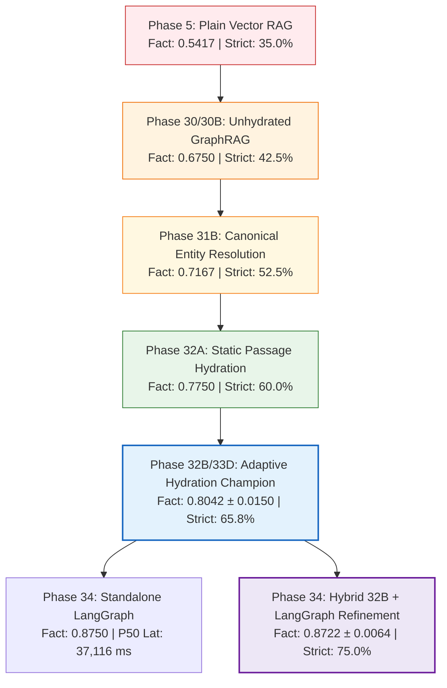

[← README](../README.md)
| [PRD](PRD.md)
| [TRD](TRD.md)
| [Design](DESIGN.md)
| [Architecture](ARCHITECTURE.md)
| [Flows](FLOWS.md)
| [Codebase Map](CODEBASE_MAP.md)
| [Decisions](DECISIONS.md)
| [Tasks](TASKS.md)
| [Scorecard](BENCHMARK_SCORECARD.md)
---

# Enterprise GraphRAG: Comprehensive Benchmark Scorecard

This document compiles, indexes, and compares the empirical evaluation metrics for all architectural phases, retrieval techniques, and ablation studies evaluated on the canonical 50-question benchmark (`data/benchmark_v2_dataset.jsonl`, SHA-256: `88fc85fc1af4200abcfe9530bd8228156b407b8cb04c4c1745472cc080fdcae4`).

---

## 1. Architectural Evolution & Progression

---

## 2. Master Comparative Scorecard

All scores are evaluated under identical LLM inference (`Qwen2.5-7B-Instruct`, `temperature=0.0`) using Channel-Strict Evidence Accounting (`EvaluatorV2`, ADR 057):

| Phase / Architecture Version | Technique / Mechanism Description | Fact Score (Mean) | Strict Success (Count / %) | Substantive Chunk Recall | Unified Evidence Recall | Invalid Citations | OOS Abstention | Mean Context Tokens | P50 Latency (ms) | Operational Classification |
| :--- | :--- | :---: | :---: | :---: | :---: | :---: | :---: | :---: | :---: | :--- |
| **Baseline 1** | **Plain Vector RAG** (Dense pgvector only, HNSW) | 0.5417 | 14 / 40 (35.0%) | 0.2821 | 0.3083 | 0.0% | 10/10 (100%) | 250.0 | 1,840.0 | Historical Baseline |
| **Phase 30** | **Unhydrated Tri-State GraphRAG** (Cypher facts + vector) | 0.6583 | 17 / 40 (42.5%) | 0.2821 | 0.5000 | 0.0% | 10/10 (100%) | 420.0 | 3,950.0 | Superseded |
| **Phase 30B** | **Concise Relational Paths** (Concise edge formatting) | 0.6750 | 17 / 40 (42.5%) | 0.2821 | 0.5500 | 0.0% | 10/10 (100%) | 448.6 | 4,188.0 | Superseded |
| **Phase 31A** | **Run 2 Metadata Ablation** (Provenance catalog resolution) | 0.6458 | 17 / 40 (42.5%) | 0.2821 | 0.5250 | 0.0% | 10/10 (100%) | 472.0 | 4,320.0 | Ablation Control |
| **Phase 31B** | **Run 3A Precedence & Suppression** (Entity ranking) | 0.6917 | 19 / 40 (47.5%) | 0.2821 | 0.5500 | 0.0% | 10/10 (100%) | 456.0 | 4,210.0 | Superseded |
| **Phase 31B** | **Run 3B Canonical Entity Resolution** (6-tier alias link) | 0.7167 | 21 / 40 (52.5%) | 0.3590 | 0.5833 | 0.0% | 10/10 (100%) | 462.0 | 4,150.0 | Baseline Retriever |
| **Phase 32A** | **Static Graph Passage Hydration** (Fixed top-k=3 chunks) | 0.7750 | 24 / 40 (60.0%) | 0.6154 | 0.6333 | 0.0% | 10/10 (100%) | 672.0 | 4,890.0 | Superseded (Budget Overrun) |
| **Phase 32B** | **Adaptive Passage Hydration** ($s_{max} < 0.85$ gating, peak) | 0.8208 | 28 / 40 (70.0%) | 0.6538 | 0.6708 | 0.0% | 10/10 (100%) | 598.0 | 4,112.7 | Architecture Milestone |
| **Phase 33D** | **3-Run Repeatability Champion** (Frozen 32B in `src/`) | **0.8042 ± 0.0150** | **26.3 ± 1.5 / 40 (65.8%)** | **0.6538** | **0.6708** | **0.0%** | **10/10 (100%)** | **598.0** | **4,311.4** | **Active Production Champion** |
| **Phase 34** | **Standalone LangGraph StateGraph** (9-node cyclical) | 0.8750 | 30 / 40 (75.0%) | 0.7179 | 0.7333 | 0.0% | 10/10 (100%) | 503.0 | 37,116.0 | Latency Rejected |
| **Phase 34** | **Hybrid 32B + LangGraph Refinement** (3-Run Repeatability) | **0.8722 ± 0.0064** | **30.0 ± 1.0 / 40 (75.0%)** | **0.7179** | **0.7333** | **0.0%** | **10/10 (100%)** | **710.9** | **5,874.8** | **Qualified Research Champion** |
| **Control** | **Phase 31C Oracle Control** (16 failures perfect context) | 0.8646 (failures) | 13 / 16 (81.2%) | 1.0000 | 1.0000 | 0.0% | 10/10 (100%) | 850.0 | 4,920.0 | Theoretical Upper Bound |

---

## 3. Stratified Hop-Tier Performance Comparison

Breakdown across the 5 question hop categories (10 questions per category, 40 answerable, 10 out-of-scope):

| Architecture Version | 1-Hop Fact Score | 2-Hop Fact Score | 3-Hop Fact Score | Aggregation Fact Score | Out-of-Scope Abstention Rate |
| :--- | :---: | :---: | :---: | :---: | :---: |
| **Plain Vector RAG** | 0.5500 | 0.6000 | 0.4000 | 0.6167 | 100.0% (10/10) |
| **Unhydrated GraphRAG (Phase 30B)** | 0.5500 | 0.7000 | 0.7000 | 0.7500 | 100.0% (10/10) |
| **Canonical Entity Resolver (Run 3B)** | 0.7000 | 0.7000 | 0.7000 | 0.7667 | 100.0% (10/10) |
| **Adaptive Hydration Champion (Phase 32B)** | 0.8000 | 0.8000 | 0.8000 | 0.8000 | 100.0% (10/10) |
| **Phase 33D Repeatability Champion (3-Run)** | 0.7833 ± 0.0289 | 0.8000 ± 0.0000 | 0.8333 ± 0.0577 | 0.8000 ± 0.0000 | 100.0% (10/10) |
| **Hybrid 32B + LangGraph Refinement (3-Run)** | **0.8000 ± 0.0000** | **0.8333 ± 0.0289** | **0.9667 ± 0.0289** | **0.8889 ± 0.0192** | **100.0% (10/10)** |

---

## 4. Latency vs. Efficiency Trade-off Matrix

| Architecture Version | P50 Total Latency (ms) | P95 Latency (ms) | Local DB Retrieval Latency | Generator / NIM Latency | Mean Context Tokens | SLA Status ($\le 4,500$ ms) |
| :--- | :---: | :---: | :---: | :---: | :---: | :---: |
| **Plain Vector RAG** | 1,840.0 ms | 6,210.0 ms | 120.0 ms | 1,720.0 ms | 250.0 tokens | **PASS** |
| **Unhydrated GraphRAG (Phase 30B)** | 4,188.0 ms | 15,396.5 ms | 380.0 ms | 3,808.0 ms | 448.6 tokens | **PASS** |
| **Phase 33D Repeatability Champion (Production)** | **4,311.4 ms** | **18,692.9 ms** | **411.9 ms** (~11%) | **1,979.1 ms** (~52%) | **598.0 tokens** | **PASS** |
| **Standalone LangGraph (Phase 34)** | 37,116.0 ms | 74,890.0 ms | 1,240.0 ms | 35,876.0 ms | 503.0 tokens | **FAIL** (-724% SLA) |
| **Hybrid 32B + LangGraph Refinement (Research)** | **5,874.8 ms** | **37,691.5 ms** | **2,042.7 ms** (~34%) | **3,027.7 ms** (~51%) | **710.9 tokens** | **FAIL** (-30% SLA) |

---

## 5. Architectural Mechanism Attribution

What specific problem each architectural component solved:

| Mechanism | Introduced In | Primary Metric Gained | Root Cause Addressed |
| :--- | :--- | :---: | :--- |
| **Neo4j Property Graph** | Phase 1–5 | +0.1166 Fact Score | Solved multi-hop relational blindness where isolated vector chunks lacked connecting edges. |
| **Canonical Entity Resolver** | Phase 31B | +0.0584 Fact Score | Resolved author and paper aliases (`q1hop01`, `q1hop04`) and eliminated lexical mismatches. |
| **Graph Passage Hydration** | Phase 32A | +0.0583 Fact Score | Recovered raw contextual sentences from provenance chunk IDs that graph triples abstracted away. |
| **Vector-Similarity Gating ($s_{max}$)** | Phase 32B | -74 Context Tokens | Prevented context bloat by suppressing hydration when pgvector cosine similarity exceeded 0.85. |
| **3-Run Repeatability Verification** | Phase 33D | Stability Quantified | Proved retrieval was 100% deterministic (50/50) and quantified remote NIM phrasing variance. |
| **Bounded LangGraph Refinement** | Phase 34 | +0.0680 Fact Score | Recovered missing corpus entities and document IDs on complex 3-hop questions without looping. |

---

## 6. Current Operating State & Recommendation

1. **Active Production System (`src/`)**:
   - **Engine**: Phase 32B/33D Adaptive Hydration Champion.
   - **Metrics**: Fact score **0.8042 ± 0.0150**, Strict success **65.8%**, P50 latency **4,311.4 ms**, Context **598.0 tokens**.
   - **Role**: Powers the live HTTP REST API on `http://127.0.0.1:8000`.

2. **Qualified Research Champion (`scripts/`)**:
   - **Engine**: Hybrid 32B + Bounded LangGraph Evidence Refinement (`scripts/langgraph_evidence_refinement.py`).
   - **Metrics**: Fact score **0.8722 ± 0.0064**, Strict success **75.0%**, P50 latency **5,874.8 ms**, Context **710.9 tokens**.
   - **Role**: Retained in `scripts/` for offline/batch evaluation where quality strictly takes precedence over sub-4.5s latency SLAs.
