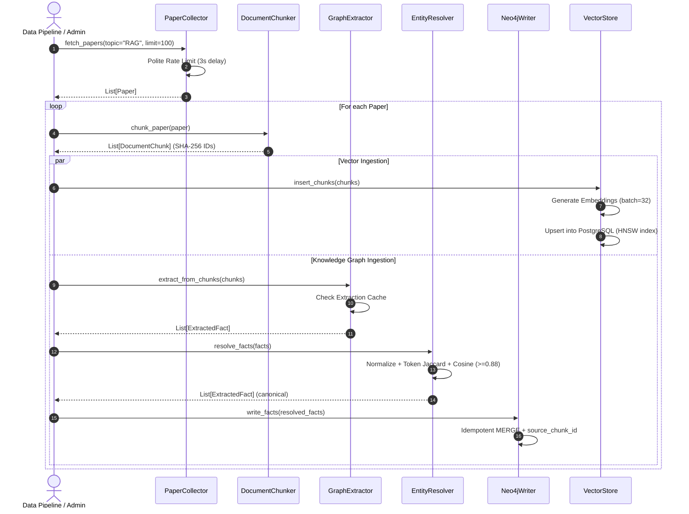
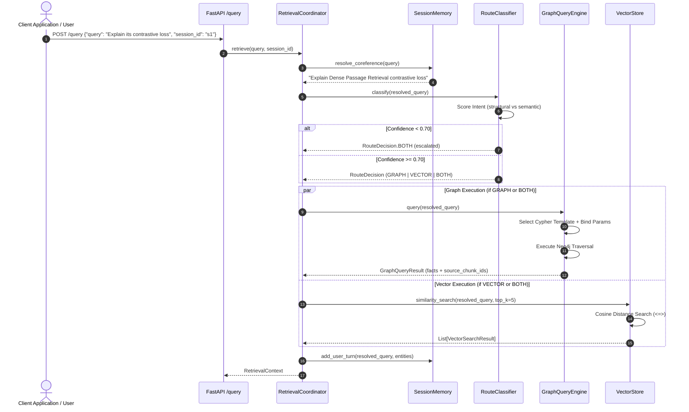
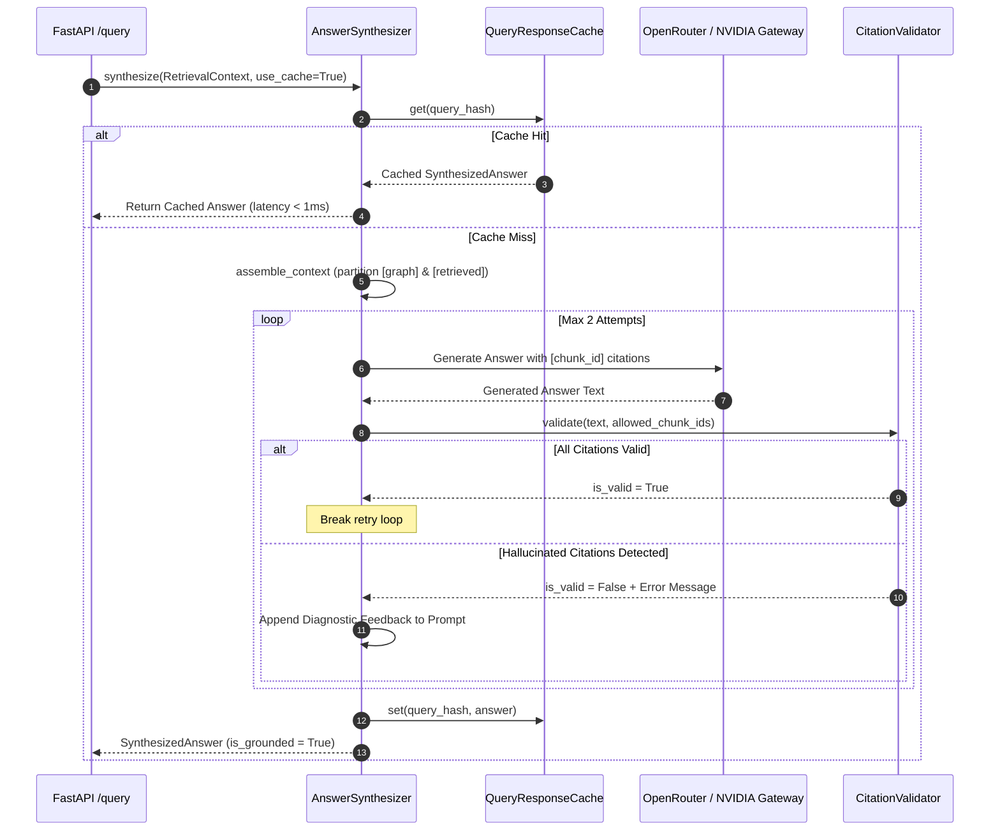
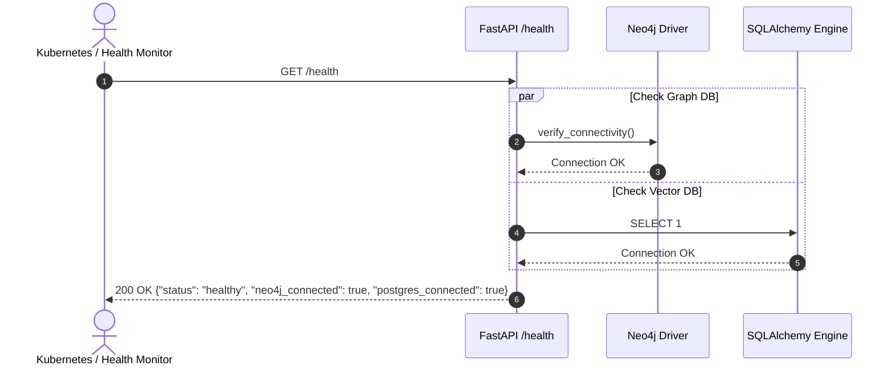
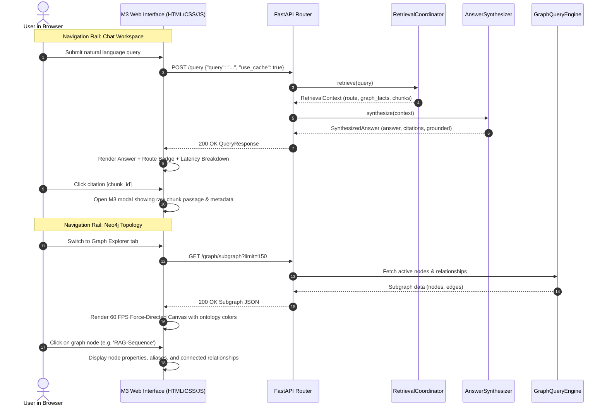
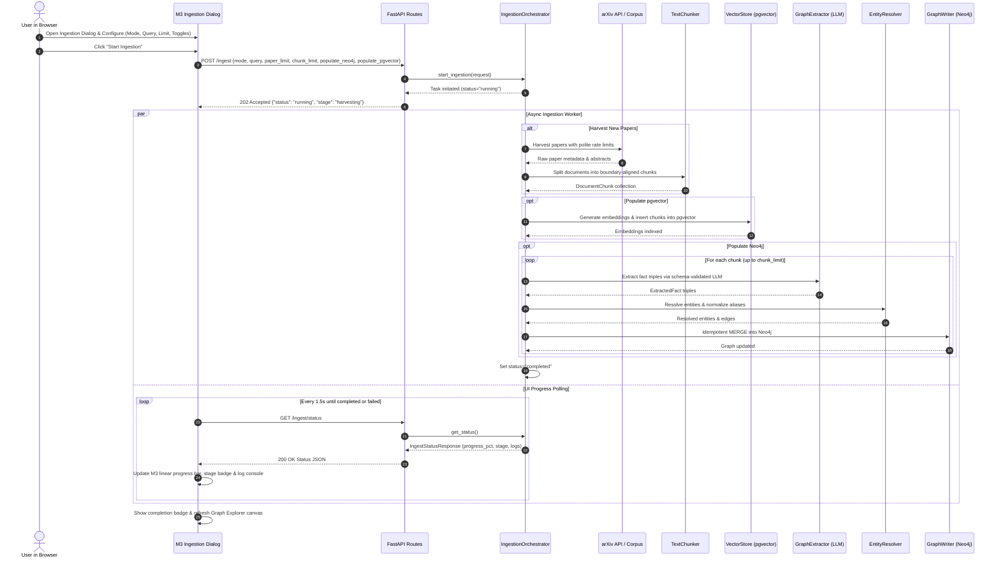
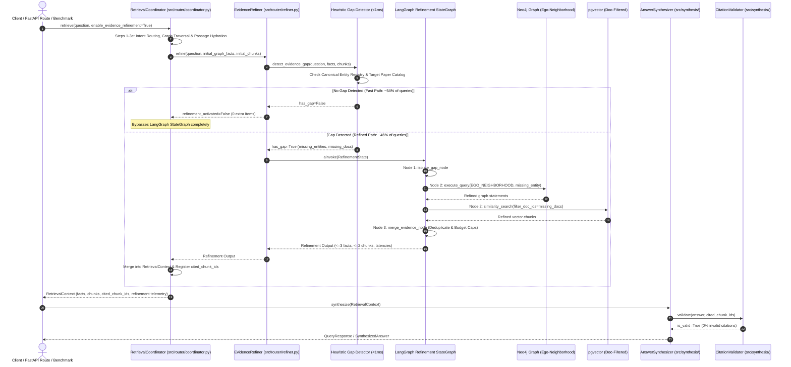

[← README](../README.md) | [PRD](PRD.md) | [TRD](TRD.md) | [Design](DESIGN.md) | [Architecture](ARCHITECTURE.md) | [Flows](FLOWS.md) | [Codebase Map](CODEBASE_MAP.md) | [Decisions](DECISIONS.md) | [Tasks](TASKS.md) | [Scorecard](BENCHMARK_SCORECARD.md)
---

# System Sequence Flows & Interaction Diagrams (FLOWS)

## 1. Corpus Ingestion & Knowledge Graph Extraction Flow

---

## 2. Coordinated Query Retrieval Flow

---

## 3. Answer Synthesis & Citation Hard-Gate Validation Loop

---

## 4. System Health Check Flow

---

## 5. Material 3 Interactive Query & Graph Exploration Flow

---

## 6. Customizable Corpus Ingestion & Live Progress Tracking Flow

---

## 7. Integrated Bounded LangGraph Evidence Refinement Flow (ADR 070)

