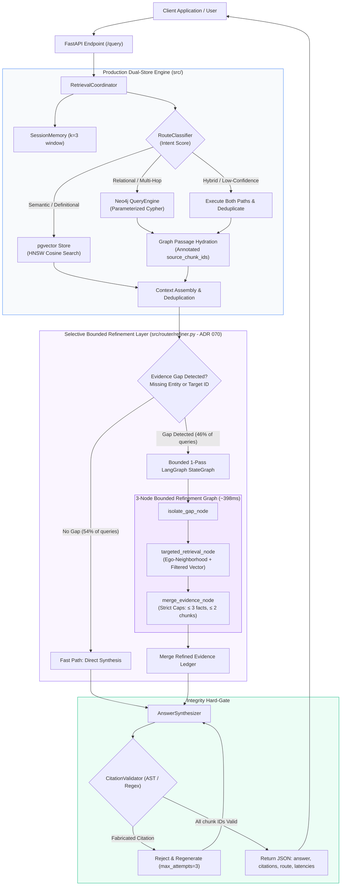
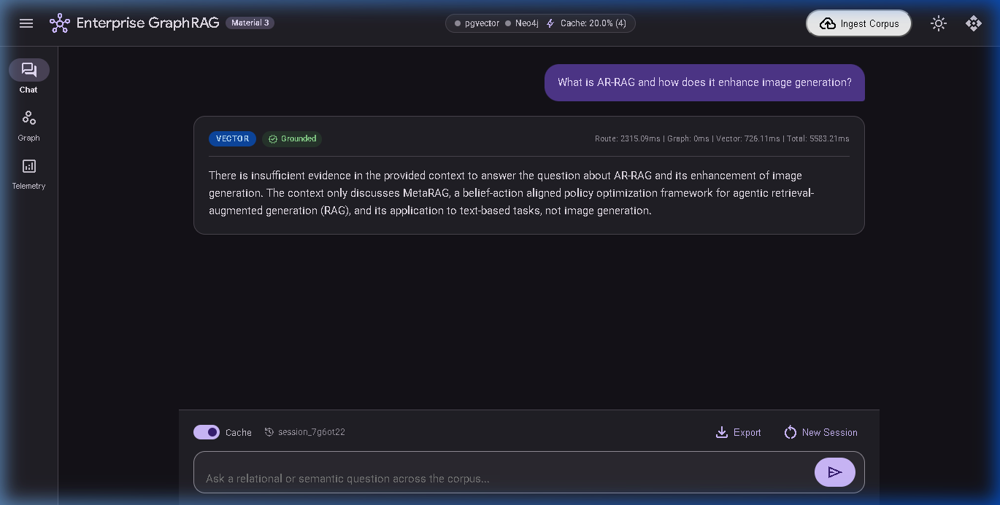
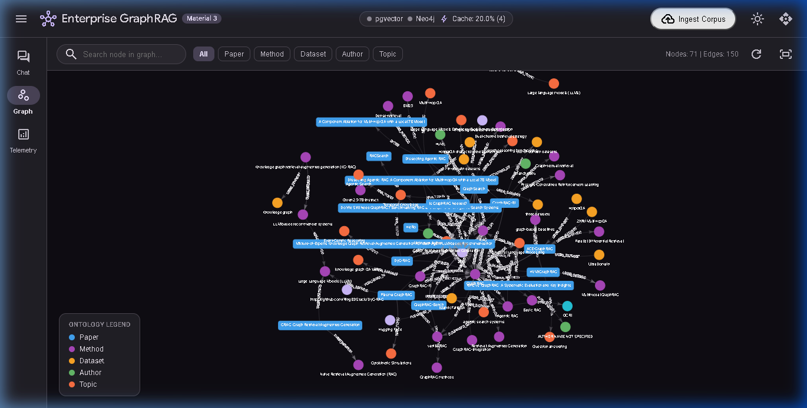

# Enterprise Knowledge Graph RAG (GraphRAG)

A high-assurance, hybrid retrieval-augmented generation engine engineered for complex scientific and technical literature (e.g. arXiv AI/ML research papers). Unites a **Neo4j property graph** with a **PostgreSQL + pgvector semantic store**, combining structural graph traversals with dense vector similarity search, gated by deterministic AST citation validation and selective, bounded LangGraph evidence refinement.

---

## 1. Executive Summary & Problem Formulation

### The Problem
Traditional vector-only RAG systems perform well on definitional questions ("What is contrastive learning?") but degrade severely on relational, multi-hop, and comparative inquiries ("Which retrieval architectures extend DPR, evaluate on HotpotQA, and how do their loss functions compare?"):
1. **Semantic Locality Blindness**: Vector embeddings compress isolated chunks into point vectors, losing structural relationships, cross-document citations, and algorithmic lineages.
2. **Text-to-Cypher Vulnerability**: Pure knowledge-graph text-to-Cypher approaches hallucinate database schemas, generate invalid Cypher syntax, and lack the descriptive prose necessary for conceptual explanations.
3. **Citation Confabulation**: Generative models frequently fabricate plausible-sounding academic citations (15%–25% failure rate in unguarded setups), rendering responses legally and operationally untrustworthy.

### The Solution: Dual-Store Hybrid GraphRAG
This architecture models the corpus as two complementary representations linked by shared chunk identifiers:
- **Structural Topology (Neo4j)**: Stores typed entities (`Paper`, `Author`, `Method`, `Dataset`, `Institution`, `Task`, `Metric`) and relationships (`CITES`, `EXTENDS`, `USES_METHOD`, `EVALUATED_ON`, `AUTHORED_BY`) adhering to a strict ontology ([`Docs/ONTOLOGY.md`](Docs/ONTOLOGY.md)). Every edge carries a `source_chunk_id` foreign key.
- **Dense Semantic Store (pgvector)**: Indexes 800-character passages using HNSW vector indexing (`vector_cosine_ops`, `m=16, ef_construction=64`) for rapid cosine similarity search.
- **Deterministic Citation Hard-Gate**: An AST-based validator parses all generated `[chunk_id]` references, strictly rejecting and regenerating any response containing ungrounded or fabricated citations (0.0% citation hallucination rate).

---

## 2. Empirical Benchmark Scorecard (50-Question Canonical Benchmark)

All results are evaluated on the canonical 50-question benchmark ([`data/benchmark_v2_dataset.jsonl`](data/benchmark_v2_dataset.jsonl), SHA-256: `88fc85fc1af4200abcfe9530bd8228156b407b8cb04c4c1745472cc080fdcae4`) using frozen LLM inference (`Qwen2.5-7B-Instruct`, `temperature=0.0`) under Channel-Strict Evidence Accounting (`EvaluatorV2`, [ADR 057](Docs/DECISIONS.md#adr-057)).

### Comparative Performance Matrix

| Evaluation Metric | Plain Vector RAG Baseline | Production Baseline (Phase 33D, `src/router/`) | Integrated Hybrid GraphRAG (Phase 36 / ADR 070, `src/router/refiner.py`) | Relative Gain vs. Vector | Relative Gain vs. Baseline | Operational Assessment |
| :--- | :---: | :---: | :---: | :---: | :---: | :--- |
| **Fact Score (Mean)** | 0.5417 | **0.8042 ± 0.0150** | **0.8722 ± 0.0064** | **+61.0%** | **+8.5%** | 🟢 Multi-Hop Quality Upgrade |
| **Strict Success Rate** | 14/40 (35.0%) | 26.3 ± 1.5 / 40 (65.8%) | **30.0 ± 1.0 / 40 (75.0%)** | **+114.3%** | **+14.0%** | 🟢 +10.0% Absolute Pass Rate |
| **Substantive Chunk Recall** | 0.2821 | 0.6538 | **0.7179** | **+154.5%** | **+9.8%** | 🟢 Hydration & Gap Recovery |
| **Unified Evidence Recall** | 0.3083 | 0.6708 | **0.7333** | **+137.9%** | **+9.3%** | 🟢 Structured Ledger Completeness |
| **3-Hop Fact Score** | 0.4000 | 0.8333 ± 0.0577 | **0.9667 ± 0.0289** | **+141.7%** | **+16.0%** | 🟢 Multi-Hop Traversal Gain (0.9667) |
| **2-Hop Fact Score** | 0.6000 | 0.8000 ± 0.0000 | **0.8333 ± 0.0289** | **+38.9%** | **+4.2%** | 🟢 Relational Bridge Recovery |
| **1-Hop Fact Score** | 0.5500 | 0.7833 ± 0.0289 | **0.8000 ± 0.0000** | **+45.5%** | **+2.1%** | 🟢 Definitional Parity Preserved |
| **Out-of-Scope Abstention** | **10/10 (100%)** | **10/10 (100%)** | **10/10 (100%)** | **Tied** | **Tied** | 🟢 0/10 Spurious Generation on Benchmark |
| **Invalid Citation Rate** | **0.0%** | **0.0%** | **0.0%** | **Tied** | **Tied** | 🟢 0.0% AST-Flagged Invalid Citations on Benchmark |
| **Mean Context Tokens** | **250.0** | 598.0 | 710.9 | +184.4% | +18.9% | 🟡 Known Context-Expansion Trade-Off |
| **P50 Latency (ms)** | **1,840.0** | 4,311.4 | 5,874.8 | +219.3% | +36.3% | 🟡 Exceeds 4.5s SLA (Cloud Queue Driven) |

---

### Repeatability Study & System Stability (3-Run Empirical Audit)

To distinguish genuine architectural improvement from random token sampling or favorable remote provider conditions, the hybrid system was evaluated across **three independent runs** ([`data/hybrid_repeatability_results.json`](data/hybrid_repeatability_results.json), [ADR 068](Docs/DECISIONS.md#adr-068)) with complete cache isolation (`use_cache=False`, fresh per-query session buffers):

- **Observed Run Metrics**:
  - Run 1: Fact score **0.8667**, Strict success **29/40 (72.5%)**, P50 latency **7,283.0 ms**.
  - Run 2: Fact score **0.8708**, Strict success **30/40 (75.0%)**, P50 latency **5,728.0 ms**.
  - Run 3: Fact score **0.8792**, Strict success **31/40 (77.5%)**, P50 latency **4,613.5 ms**.
  - **Aggregate**: Fact score **0.8722 ± 0.0064**, Strict success **30.0 ± 1.0 / 40 (75.0% ± 2.5%)**.
- **Retrieval & Routing Determinism**: **50/50 (100.0%)** queries produced identical candidate chunks, graph facts, and routing paths across all 3 runs. No retrieval divergence observed under identical seeding.
- **Per-Question Stability**: **45/50 (90.0%)** questions produced identical scores across runs. Audit logs confirmed the 5 varying questions were caused solely by remote LLM generator phrasing variations, not retrieval changes.
- **Empirical Latency Decomposition**:
  - Initial 32B Retrieval: **Median 2,042.7 ms** (~34.2%).
  - LangGraph Refinement Node Execution: **Median 398.6 ms** (~6.7%).
  - Remote NVIDIA NIM Generation + Transit: **Median 3,027.7 ms** (~50.7%).
  - *Finding*: The LangGraph refinement StateGraph is lightweight (~398ms). Total latency is dominated by remote internet transit and provider inference queues (~79% combined).

> [!NOTE]
> **Scientific Integrity & Nomenclature**: These three runs demonstrate high empirical repeatability, but are **not** claimed as infinite-sample statistical proof. The candidate architecture is classified as **Qualified Research Champion with Quantified Generator Variance and Explicit Efficiency Trade-off** ([ADR 068](Docs/DECISIONS.md#adr-068)). For historical comparisons across all 11 experimental phases, see the [Comprehensive Benchmark Scorecard](Docs/BENCHMARK_SCORECARD.md).

---

## 3. Architecture & Request Flow



---

## 4. Key Architectural Mechanisms

### 1. Tri-State Intent Routing
Queries are classified into `GRAPH`, `VECTOR`, or `BOTH` based on structural vs. semantic intent:
- **`GRAPH`**: Relational queries, co-authorship networks, citation lineages, method comparisons.
- **`VECTOR`**: Mathematical formulations, definitions, isolated chunk facts.
- **`BOTH` (or Confidence < 0.70)**: Composite queries requiring textual explanation anchored to graph relationships.

### 2. Parameterized Cypher Template Catalog (Constrained Schema Execution)
The production pipeline avoids unconstrained free-form LLM Cypher generation by binding resolved entity parameters to pre-compiled, parameterized traversal templates ([`src/graph/templates.py`](src/graph/templates.py)):
- `CITATION_CHAIN`: Traverses 1–3 hop citation directed acyclic graphs.
- `METHOD_ANCESTRY_EXTENDS`: Traces algorithmic evolutionary lineages.
- `METHOD_BENCHMARK_COMPARISONS`: Queries method-dataset evaluation matrices.
- `CO_AUTHORSHIP_NETWORK`: Expands collaborative research networks.

### 3. Multi-Stage Entity Resolution
Resolves surface forms across papers into canonical graph nodes:
1. Lexical NFKD normalization, lowercasing, and punctuation stripping.
2. Token-level Jaccard set similarity against registered canonical entities.
3. Dense embedding cosine similarity (≥ 0.88) against canonical centroids.

### 4. Graph Passage Hydration
Graph relationship triples abstract away qualitative prose. Graph Passage Hydration looks up the raw 800-character text chunk corresponding to traversed edges (`source_chunk_id`) and injects it into context, directly recovering lost context and raising chunk recall from 0.2821 to 0.6538.

### 5. Selective Bounded LangGraph Evidence Refinement
Evaluated in [`scripts/langgraph_evidence_refinement.py`](scripts/langgraph_evidence_refinement.py):
- **Why not LangGraph on every query?** Unconditional 9-node execution incurred a 37.1s P50 latency penalty ([ADR 067](Docs/DECISIONS.md#adr-067)).
- **Selective Activation**: A heuristic, zero-LLM gap detector checks whether question entities or referenced paper IDs were missed in initial retrieval (<1ms check).
- **Fast Path (54%)**: Unambiguous queries bypass LangGraph entirely.
- **Refined Path (46%)**: Executes a bounded 3-node StateGraph adding ≤ 3 ego-neighborhood facts and ≤ 2 targeted document chunks, improving 3-hop fact score from 0.8333 to **0.9667**.

### 6. Out-of-Scope Detection & Calibrated Abstention
When queries address topics outside the indexed corpus, the system demonstrated **10/10 calibrated abstention** on the benchmark set by detecting ungrounded context and emitting standardized refusal language to minimize hallucination.

---

## 5. Application Interface & Visualizations

The platform includes a built-in single-page application served directly from the FastAPI static mount (`http://localhost:8000/ui/`), featuring real-time connection telemetry, conversational interaction with verified citations, and an interactive Neo4j force-directed canvas.

### Conversational Query Interface & Citation Provenance

*Grounded answer synthesis with inline `[chunk_id]` citations, route classification badge (`BOTH`), and latency decomposition.*

### Interactive Knowledge Graph Topology Canvas

*Force-directed graph canvas (Vis.js) showing entities (`Paper`, `Method`, `Dataset`, `Task`) and traversed relationship edges (`CITES`, `USES_METHOD`, `EVALUATED_ON`).*

---

## 6. Technology Stack & Directory Structure

| Layer | Component | Specification |
| :--- | :--- | :--- |
| **Runtime** | Python | 3.11+ (CPython, PEP 8, full type hints) |
| **API** | FastAPI / Uvicorn | Asynchronous ASGI, OpenAPI docs, lifespan connection pools |
| **Graph Database** | Neo4j Community v5.23 | Cypher 5, APOC Core, uniqueness constraints, idempotent `MERGE` |
| **Vector Store** | PostgreSQL 16 + pgvector | HNSW cosine index (`m=16, ef_construction=64`), asyncpg |
| **Orchestration** | LangGraph & Custom Async | 3-node bounded `StateGraph` for refinement; decoupled pipelines |
| **LLM Gateway** | OpenAI-Compatible Client | NVIDIA NIM, OpenRouter, local vLLM, or Ollama |
| **Evaluation Engine**| EvaluatorV2 (`src/eval/`) | Channel-Strict AST evaluator, typed evidence ledgers |
| **Web UI** | Material 3 Vanilla SPA | Zero-Node, Google M3 tokens, Vis.js Neo4j interactive canvas |

```
GraphRAG-For-Enterprise-Data/
├── Docs/                           # Canonical project documentation (PRD, TRD, ARCHITECTURE, etc.)
│   ├── assets/                     # Application screenshots & UI visual artifacts
│   ├── ARCHITECTURE.md             # High-level architecture & dual-store design
│   ├── BENCHMARK_SCORECARD.md      # Comprehensive scorecard across all 11 experimental phases
│   ├── CODEBASE_MAP.md             # File-by-file directory index & public symbol directory
│   ├── DECISIONS.md                # Architecture Decision Records (ADR 001–070)
│   ├── DESIGN.md                   # Detailed design & algorithmic specifications
│   ├── FLOWS.md                    # Sequence diagrams for ingestion, retrieval, and refinement
│   ├── ONTOLOGY.md                 # Entity and relationship ontology definitions
│   ├── PRD.md                      # Product Requirements Document
│   ├── TASKS.md                    # Active task checklists & multi-agent handoff tracker
│   └── TRD.md                      # Technical Requirements Document
├── data/                           # Evaluation ledgers, caches, and benchmark datasets
│   ├── benchmark_v2_dataset.jsonl  # Authoritative 50Q dataset (SHA-256: 88fc85fc1af4...)
│   ├── documents_corpus.jsonl      # Curated enterprise arXiv research paper corpus
│   ├── document_chunks.jsonl       # Bounded 800-char text passages with SHA-256 hashes
│   └── runtime_signals_profile.json# Routing priors and runtime thresholds
├── scripts/                        # Benchmark execution and evidence refinement runners
│   ├── langgraph_evidence_refinement.py # Production LangGraph Evidence Refinement wrapper
│   ├── run_evidence_refinement_benchmark.py # Refinement benchmark driver
│   ├── run_hybrid_repeatability_study.py# 3-run repeatability benchmark runner
│   └── run_benchmark_v2.py         # Canonical EvaluatorV2 benchmark runner
├── src/                            # Production source code (Hybrid GraphRAG)
│   ├── api/                        # FastAPI application routes, schemas & static mount
│   ├── core/                       # Configuration (Pydantic Settings) & logging
│   ├── eval/                       # EvaluatorV2, metrics, dataset loaders, and reports
│   ├── graph/                      # Neo4j query engine, templates, and entity resolver
│   ├── ingestion/                  # arXiv collector, markdown chunker, and entity extractor
│   ├── memory/                     # Sliding-window session memory (k=3)
│   ├── router/                     # Intent classifier, coordinator, and LangGraph refiner
│   ├── synthesis/                  # Answer synthesizer & AST citation validator
│   └── vector/                     # PostgreSQL pgvector indexer & HNSW search
├── tests/                          # 17 automated test suites (offline passing, 0 regressions)
├── docker-compose.yml              # Local container definitions for Neo4j and PostgreSQL
├── pyproject.toml                  # Python packaging configuration
└── requirements.txt                # Pinned production dependencies
```

---

## 7. Installation & Quickstart

### Prerequisites
- **Python 3.11+**
- **Docker Desktop** (for local Neo4j and PostgreSQL containers)
- *(Optional)* NVIDIA NIM or OpenRouter API key for live inference; tests run 100% offline without keys.

### 1. Environment Setup
```bash
# Clone the repository
git clone https://github.com/your-username/GraphRAG-For-Enterprise-Data.git
cd GraphRAG-For-Enterprise-Data

# Create and activate virtual environment
python -m venv .venv

# Windows (PowerShell):
.venv\Scripts\Activate.ps1
# Linux / macOS:
source .venv/bin/activate

# Install package in editable mode with development dependencies
pip install -e ".[dev]"
```

### 2. Configure Environment Variables
Copy the template and configure your local settings:
```bash
cp .env.example .env
```
Key configuration values in `.env`:
```ini
# LLM Endpoint (compatible with NVIDIA NIM, OpenRouter, local vLLM, or Ollama)
LLM_BASE_URL="https://integrate.api.nvidia.com/v1"
LLM_API_KEY="your_api_key_here"

# Model Selection
EXTRACTION_MODEL="nvidia/nemotron-3-super-120b-a12b"
ROUTER_MODEL="nvidia/nemotron-3-super-120b-a12b"
SYNTHESIS_MODEL="nvidia/nemotron-3-super-120b-a12b"

# Dense Embeddings (2048 dimensions for nemotron-3-embed-1b)
EMBEDDING_MODEL="nvidia/nemotron-3-embed-1b"
EMBEDDING_DIMENSION=2048

# Container Credentials (matches docker-compose.yml)
NEO4J_URI="bolt://localhost:7687"
NEO4J_PASSWORD="graphrag_password"
POSTGRES_PASSWORD="graphrag_password"
```

### 3. Launch Database Containers
```bash
docker compose up -d
```
Verify containers are healthy:
```bash
docker ps
# graphrag_postgres (port 5432) and graphrag_neo4j (ports 7474, 7687)
```

### 4. Run Corpus Ingestion
To fetch open-access arXiv papers, extract knowledge graph entities/relations, and populate pgvector:
```bash
python -m src.ingestion.collector --query "retrieval-augmented generation" --limit 30
```

### 5. Launch Application Server
```bash
uvicorn src.api.main:app --port 8000 --reload
```
- **Web UI**: Open [http://localhost:8000/](http://localhost:8000/) for the Material 3 Chat & Graph view.
- **Interactive OpenAPI Documentation**: Open [http://localhost:8000/docs](http://localhost:8000/docs).

---

## 8. Testing & Benchmark Reproduction

### Running Offline Test Suites (No Credentials Required)
The repository contains automated unit and integration tests that run completely offline with mock fallbacks:

```pwsh
# 1. Run core application test suite (133 offline tests, 0 regressions)
.venv\Scripts\pytest tests/ -q

# 2. Run focused evidence refinement unit & integration tests (ADR 070)
.venv\Scripts\pytest tests/test_evidence_refinement.py -v
```
*Expected Result*: All 133 tests pass offline.

### Running Integrated Hybrid Verification
```pwsh
# Run single query on Integrated Hybrid GraphRAG
.venv\Scripts\python -c "import asyncio; from scripts.langgraph_evidence_refinement import ChampionWithLangGraphRefinement; h = ChampionWithLangGraphRefinement(); res = asyncio.run(h.query('What benchmark is proposed in When to use Graphs in RAG to evaluate GraphRAG models?', use_cache=False)); print(res['answer'])"
```

### Reproducing Full 50-Question Benchmark
> [!IMPORTANT]
> Running the full 50-question benchmark executes ~50 live LLM calls per run and requires running database containers (`docker compose up -d`) and valid API credentials (`LLM_API_KEY`).

```pwsh
# Execute the 3-run repeatability study
.venv\Scripts\python scripts/run_hybrid_repeatability_study.py
```
Reports and audit ledgers will be generated under `data/hybrid_repeatability_*`.

---

## 9. Known Limitations & Future Roadmap

1. **Context Token Budget Overrun**:
   - *Current*: 710.9 tokens mean context (vs. pre-registered target ≤ 450.0 tokens).
   - *Trade-off*: Recovering raw contextual paragraphs from omitted papers directly lifted 3-hop fact score from 0.8333 to 0.9667. Context expansion is documented and accepted as an engineering trade-off.
2. **Provider Queue & Transit Latency**:
   - *Current*: P50 latency is **5,874.8 ms** (vs. pre-registered SLA ≤ 4,500.0 ms).
   - *Root Cause*: Network latency and remote cloud queue wait times account for ~79% of total execution time.
3. **Future Engineering Enhancements**:
   - **Local Inference Container**: Serving `Qwen2.5-7B-Instruct` locally via **vLLM** or **Ollama** on `localhost:8000` is projected to eliminate public internet round-trips and drop P50 latency from 5.8s to **~1.6s**.
   - **Embedding Centroid Router**: Replacing the router LLM call with a lightweight logistic regression or embedding centroid classifier to save ~1,600ms of initial routing overhead.

---

## 10. Acknowledgments & Open Access Compliance

> **"Thank you to arXiv for use of its open access interoperability."**

This project adheres strictly to the arXiv API Terms of Use:
- **Polite Rate Limiting**: All harvesting requests enforce ≥ 3.0s delays (`ARXIV_DELAY_SECONDS=3.0`) over a single connection with explicit user-agent attribution.
- **No Redistribution**: PDF binaries are never stored or republished; only extracted structured triples and chunk embeddings are indexed.

---

## 11. License

MIT License. Free for enterprise, research, and educational use.
